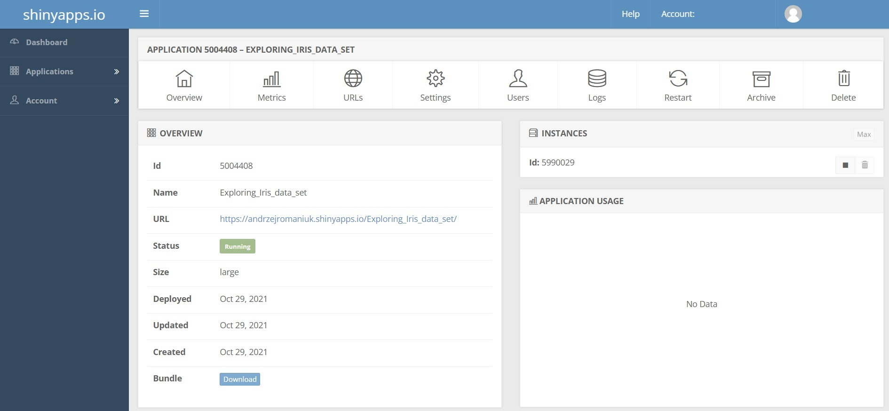

```{r setup, include=FALSE}
knitr::opts_chunk$set(echo = TRUE)
```

|

\begin{center}
\rule{1\textwidth}{.4pt}
\end{center}

```{r fig.align="center", fig.show="hold", echo=FALSE, out.width = '45%'}

```

```{r fig.align="center", figures-side, fig.show="hold", echo=FALSE, out.height = '10%'}

knitr::include_graphics("visual/shiny.png")
```

\renewcommand{\footnoterule}{\vfill\kern -3pt \hrule width 1\columnwidth \kern 2.6pt}

\pagebreak
\begin{center}
\rule{1\textwidth}{.4pt}
\end{center}

## Why create your own web apps (and why in Shiny)? {#why}

Sometimes raw code, accompanied by pre-generated tables and visualizations, is not enough to effectively convey the meaning of one's work. Various types of output files are by design static, showcasing results but not the analysis behind them. In turn, code itself, a step-by-step description of an analysis, is generally hard to effectively present and explain to non-coding colleagues or a conference attendees. Both approaches also reduce any interaction with a wider public down to passive participation, often discouraging even the most dedicated audience.

These issues can be resolved by giving people more freedom in exploring both data and the analysis process itself, which can be easily done via an interactive web application. Those engaging with an app will be able to explore data and generate research results on their own, gradually and organically coming to understand what utilized data actually mean and why the author made specific choices during the analysis rather than being told about it. Coding dedicated web apps can also enhance one's research by providing an easy way to explore data and different analytic approaches, simplifying sharing it with other researchers, automating one's work and bypassing the need for tinkering directly with the code itself.

R can be successfully used to write apps with the aid of Shiny. Shiny is a little bit more than just a library of dedicated functions, it is a whole framework of solutions for creating, running, sharing and deploying apps. While it may sound complex, it is perhaps the easiest way to experience the entry-level of app development. Shiny app structure is surprisingly simple yet insanely flexible, allowing applications as complex as user wants them to be. Knowledge of HTML, CSS or JavaScript, basic languages used when building an app, is not a necessity. Everything can be written in R, with Shiny then the code can be translated into relevant languages on its own.

If you already know how to code in R, why not take a step further?


\pagebreak
\begin{center}
\rule{1\textwidth}{.4pt}
\end{center}

## Introduction {#introduction}

|
| 
**What you will (or won't) learn**

| 
The aim of this tutorial is primarily to familiarize you with all key stages of web app creation with Shiny. It will not show or discuss all the functions and related possibilities currently present within the main Shiny library or supporting libraries and web services (there are whole books written on those subjects). Instead, the tutorial makes sure that, by the end, you will have a functional understanding of how web applications work, know the basics necessary to create one from scratch in R, and where to search for further information if you wish to delve deeper into this subject.

| 
| 
**Tutorial layout**

| 
Firstly, see [*Before you start*](#beforestart) to check which libraries you need to install. Additionally, take a look at [*Starting a Shiny app *](#Starting) to get information on how to set up/use the script file when writing an app.

Due to the importance of theory in understanding the inner structure and workings of a web app, the tutorial proper starts with a short description of key web app features and how they relate to each other ([*How web applications work?*](#howappswork)). Then the tutorial proceeds with explaining how the general app structure is reflected within a Shiny framework ([*Shiny: app structure*](#appstructure)). Once the basic structure is understood, the tutorial proceeds by explaining each stage of creating an app, from designing a user interface ([*Shiny: UI, designing layout*](#designinglayout)) and getting user input ([*Shiny: UI, getting user input*](#gettinginput)), through processing input to get output ([*Shiny: server and rendering output*](#renderingoutput)) and displaying it on the user interface ([*Shiny: UI, displaying output*](#displayingoutput)), ending with discussion of an example of a completed, functional app ([*Shiny: a functional example*](#functionalexample)).
Alongide the explanation, some fundamental UI customization options ([*Shiny: app themes*](#customization); [*Shiny: writing in-app*](#customization2)) are also presented.

|
The tutorial ends with a brief discussion of key venues for sharing or publishing a shiny app ([*Sharing/deploying an app*](#Publishing)).If by the end  you are interested in mastering Shiny to a greater degree, see [*Closing remarks*](#remarks) and [*Further reading and external resources*](#furtherreading) pages. The first briefly discusses possible venues for developing your Shiny skills further. The second includes links to all the relevant sites, including tutorials of various degrees of complexity, presentations and reference sheets summarizing key points, ending with books with in-depth knowledge about building complex Shiny applications and hosting them online.


\pagebreak
\begin{center}
\rule{1\textwidth}{.4pt}
\end{center}

## Before you start {#beforestart}

|
| 

**Requirements, skill level:** 

| 
This tutorial assumes you are already acquainted with coding in R. Especially important for understanding how Shiny works is knowing how functions in R are defined and how to nest them within each other. As the main goal of Shiny apps is to create results based on user input, experience with data wrangling and visualization in R is also important. 

| 
If you want to familiarise yourself with R first, in particular with data wrangling and data visualisation, you can have a look at the resources available on the CDCS GitHub page [here](https://github.com/DCS-training).

| 
| 
**Requirements, software:** 

| 
The code presented here was tested on Windows 10. Both **R** & **RStudio** are required, preferably the newest iterations (R ver. 4.03 or later; RStudio ver. 1.3.1073 or later). For specific libraries necessary for installation see below:

| 
```{r eval=FALSE, echo=TRUE}
#Key
shiny          # R interface for Shiny app creation
rsconnect      # deployment interface for Shiny apps

#Customization
shinythemes    # Elements to customize a Shiny app
shinyWidgets   # Library of custom widgets for Shiny

#Visualization
DT             # R interface for interactive tables
ggplot2        # Declarative creation of graphics

```
<!-- rmarkdown      # R interface for creating websites and various documents -->
<!-- shinydashboard # Simple frame for dashboard creation -->

| 
| 
**Data set and the example code:** 

| 
Fisher/Anderson's Iris data set, containing four columns with measurements in cm for three species of irises, is used thought the tutorial. It is an integral part of the RStudio, and can be called in by writing *iris* in the console. As the aim is to understand how to create a functional app, the examples are centered on exploring the data set via provided numeric (4 measurements) as well as categorical (species) data. The app example, including files to generate the tutorial PDF itself, can be accessed [here](https://github.com/DCS-training/ShinyTutorial). 

| 

\pagebreak
\begin{center}
\rule{1\textwidth}{.4pt}
\end{center}

## Starting a Shiny app  {#Starting}

|
|
```{r fig.align="center", fig.show="hold",out.width = '70%', fig.cap = "How to create a new R file with Shiny", echo=FALSE}
knitr::include_graphics("visual/Starting.jpg")
```

|
Once the libraries are installed, a new Shiny app can be created either by starting to code in an existing empty R file or by navigating *File > New file > Shiny Web App...* to create a new file.

|
```{r fig.align="center", fig.show="hold",out.width = '70%', fig.cap = "RStudio prompt when creating a new file", echo=FALSE}
knitr::include_graphics("visual/NewShinyWebApp.jpg")
```
|
If you decide to create a new file through *Shiny Web App...* you will be first asked where you wish to create an app in one or multiple R files. The reason behind the prompt will be answered early in this tutorial, but for now I suggest starting with just one file. Once the option is selected, a new app is named and its location defined, a new file will be created. It will contain an example code for a very simple app, can be either completely erased or repurposed.


\pagebreak
\begin{center}
\rule{1\textwidth}{.4pt}
\end{center}

|

```{r fig.align="center", fig.show="hold",out.width = '60%',fig.cap = "Changes to the file/source display", echo=FALSE}
knitr::include_graphics("visual/Difference.jpg")
```

|

In the case of starting with a completely empty R file, file display options initially will be the same as any other R script file. However, once the key functions of a Shiny app (explained later in the tutorial) are included and the file is saved, RStudio will update applicable options in the upper right corner of the file display. "Run" button will change into a "Run App" button. Results of running an app, instead of being saved in an environment, will be displayed in a separate window due to RStudio simulating a web server environment.

Additionally, a "publish the application or document" button (blue "eye" sign) will also be displayed. It allows you to publish the results of your work directly to dedicated repositories or servers, as long as you have configured RStudio to work with  them.


|

```{r fig.align="center", fig.show="hold",out.width = '90%',fig.cap = "RStudio simulating server environment to run a Shiny app", echo=FALSE}
knitr::include_graphics("visual/RunningAppRStudio.jpg")
```

\pagebreak
\begin{center}
\rule{1\textwidth}{.4pt}
\end{center}

## How do web applications work? {#howappswork}

|
```{r fig.align="center", fig.show="hold",  fig.cap = "Web app, simplified structure", echo=FALSE}

```

|
 
Despite web applications coming in all shapes and forms, they all share the same structure.

What we, the users, see when running an app is called a user interface, "UI" for short. UI provides means for a user to interact with an application. Primarily, it gathers input, for example through pressed buttons or written text, and provides expected output, like tables or plots formatted accordingly to input. Today we are mostly interacting with graphic user interface (GUI), but there is a variety of different approaches to user-app interaction, from displaying command lines up to utilizing e.g. sound for communication (voice user interface). UI can be also understood as the "front end" of an application, with front-end developers meaning programmers dealing mostly with this side of an application.

However, the computation of output does not happen within the UI, but on a server-side ("back-end") of an application. Here all the requests are being processed according to coded logic, using files (i.e. datasets) included or ones provided by the user. Rendered output is then passed back to the UI for display. When an app is run, UI and server are constantly communicating with each other. Every time input data changes the server computes an output again, with then UI updating output displayed.

\pagebreak
\begin{center}
\rule{1\textwidth}{.4pt}
\end{center}

## Shiny: app structure {#appstructure}

|
| 

Not surprisingly, the layout of a Shiny app follows the same logic as every other application. Elements of the UI, like general layout, interactive elements (e.g. buttons, scrolls, text input) and output display are defined within *fluidPage()* function. In turn, the server-side of an app is defined actively while you code, but with keeping in mind the internal logic of an app. In *function(input, output, session) {}* two key elements are input and output as pre-defined arguments, with all the code to be run included in {}. The function that combines UI and server elements into a functional whole is *shinyApp()*, which needs two key arguments, named UI and server. 

As Shiny supports css, any app written in R will be able to automatically adapt and resize to fit different displays (e.g. PC, phone display).

|
|
```{r eval=FALSE, echo=TRUE}
#Standard Shiny app structure
  ui <- fluidPage(/arguments input here/)

  server <- function(input, output) {/code input here/}
  
  shinyApp(ui = ui, server = server) 
 
   
#However, it is possible to define (nest)
#UI and server within shinyApp() function
shinyApp(
  ui = fluidPage(/arguments input here/),
  server = function(input, output) {/code input here/}
) 

#For the ease of working with other Shiny solutions, make sure that,
#when saving, your R script file with Shiny app within is named app.R

#Ui and server can be separate files, named ui.R and server.R
#if stored in the same folder, and both scripts calling the same libraries
#the app can be run as if there were bound by shinyApp()
```

\pagebreak
\begin{center}
\rule{1\textwidth}{.4pt}
\end{center}

## Shiny: UI, designing layout {#designinglayout}
|
| 

```{r fig.align="center", fig.show="hold",out.width = '90%',  fig.cap = "Left - shematic sidebar layout; Right - formulation of that layout via code nesting", echo=FALSE}

```

|

So, how do we code in the layout of our app user interface? It is essentially a two-stage approach. We first define what general structure the layout would follow by nesting a specific function within *fluidPage()*. The simplest, and included as default, is *sidebarLayout()*. It contains two areas (panels): the main panel, intended to display results, and the side panel, for widgets necessary for collecting user input. The location of a sidebar is defined by an argument *position*, which is assigned as *position = "left"* by default. Both panels are nested with the layout function by using *sidebarPanel()* and *mainPanel()* functions. 

|
```{r eval=FALSE, echo=TRUE}
#Standard layout
  ui <- fluidPage(
    sidebarLayout(     
      sidebarPanel(),
      mainPanel()
      )
    )

#--//--, sidebar on the right side
  ui <- fluidPage(
    sidebarLayout(
      position = "right",     
      sidebarPanel(),
      mainPanel()
      )
    )
```

\pagebreak
\begin{center}
\rule{1\textwidth}{.4pt}
\end{center}

|

There are other layouts and panel types one can use when designing own application. For example, *flowLayout()* and *verticalLayout()* enables creating an app with multiple panels. For even more freedom, *fluidRow()* and *fixedRow()* enable coding in a grid layout and fitting panels in a specific position. Among more popular panel functions *titlePanel()* and *headerPanel()* may be of use if one wants to display an app name, and can be nested before establishing a layout itself. While elements can be included without declaring a creation of a new panel, the best practice is to gather them together, e.g. for inputs by using *inputPanel()* or *wellPanel()*. See [here](https://bookdown.org/weicheng/shinyTutorial/ui.html#layout) or [here](https://shiny.rstudio.com/articles/layout-guide.html) for further explanation and examples on how to design a layout and nest in required panels.


```{r fig.align="center", fig.show="hold",out.width = '90%', fig.cap = "Left - tabset layout; Right - formulation of that layout", echo=FALSE}

```

|
App layout can be defined only by using panel functions, especially if we nest them into each other. For example, *tabsetPanel()* is a master function for creating and displaying tabs, with *tabPanel()* panel function used to create specific tabs. See code below for a functional example:

|

```{r eval=FALSE, echo=TRUE}
#Tabset layout, based on nested panel functions
  ui <- fluidPage(
    titlePanel(
    h1("tabset layout",   # App Title 
       align = "center")  # (predef. size, h1, and alignment)
    ),
    tabsetPanel(          #Panel or layout with tabs
      tabPanel("tab1"),   #Tab for panel #1
      tabPanel("tab2"),   #Tab for panel #2
      tabPanel("tab3")    #Tab for panel #3
      )
    )
#NavlistPanel() would also work instead of tabsetPanel()
#With tabs being displayed as sidebar
```

\pagebreak
\begin{center}
\rule{1\textwidth}{.4pt}
\end{center}


## Shiny: app themes {#customization}


|
```{r fig.align="center", fig.show="hold",out.width = '90%', fig.cap = "Shiny app with the theme selector active", echo=FALSE}
knitr::include_graphics("visual/Customization.jpg")
```

| 
| 
One of the easy ways to further customize a Shiny app, without going too much into details, is to use *shinythemes* library. It contains over 15 different themes, changing layout colour, font type and size, and minor stylistic elements (e.g. differently looking buttons/checkboxes). To use a specific theme one just need to put *shinytheme()* argument into the *fluidpage()* function, with the theme name included within. If you're not certain which theme to use, you can include *themeSelector()* as an argument instead, which will provide one with a pop-up window with all themes present when run. More info about this library can be found [here](https://rstudio.github.io/shinythemes/).

| 
```{r eval=FALSE, echo=TRUE}
#Necessary library
library(shinythemes)

ui <- fluidPage(
  theme = shinytheme("yeti"), #Including a specific theme
  themeSelector() #Exploring possibilities via in-app theme selector 
  )
```

\pagebreak
\begin{center}
\rule{1\textwidth}{.4pt}
\end{center}


## Shiny: writing in-app {#customization2}

```{r fig.align="center", fig.show="hold",out.width = '100%', fig.cap = "Written text displayed in a Shiny app", echo=FALSE}

```
| 
| 
Sometimes you may want to put a written text in the application itself, for example a reason for the app or a basic outline of how to use it. 

It can be easily done by using several different functions, elaborated on [here](https://shiny.rstudio.com/tutorial/written-tutorial/lesson2/). For example, *p()* function is commonly used to embed simple text paragraphs, with *strong()* doing the same but with text in bold while *em()* produces italicized text. If someone wants to display text input like a code would be displayed, *code()* can be used. Other often utilized functions are *h1()* to *h4()*, which can render titles of different sizes.

Text can be embed on any level of the ui. It is possible to e.g. include *h1()* with the app name directly within fluidPage(). However, generally for a written text I suggest creating a dedicated panel, for the better readability.

| 
```{r eval=FALSE, echo=TRUE}
#Writing in-app, examples
ui <- fluidPage(
  h1("title, first level"),
  p("text paragraph"),
  strong("text in bold"),
  em("italicized text"),
  code("text displayed like a code")
  )
```

\pagebreak
\begin{center}
\rule{1\textwidth}{.4pt}
\end{center}

## Shiny: UI, getting user input {#gettinginput}
|
```{r fig.align="center", fig.show="hold",out.width = '100%', fig.cap = "Side panel with widget examples embedded", echo=FALSE}

```

|
| 
Widgets are essentially web interactive elements used to obtain input data from the user. They may be buttons, sliders or checkboxes, but also areas to write in user's answer or even upload own documents. The list of basic widgets is available [here](https://shiny.rstudio.com/gallery/widget-gallery.html), with related code [here](https://shiny.rstudio.com/tutorial/written-tutorial/lesson3/). The list of custom widgets from the *shinyWidgets* library is available [here](http://shinyapps.dreamrs.fr/shinyWidgets/). 

While possible arguments to define differ between widget functions, all will start from an argument defining a name of an object which will store an input (in case of Shiny library functions, under the name *inputId*), with a possibility to define a widget name under *label* argument. For some widgets defining only input id and its label is enough to work properly (*textInput*), while others require additional information, for example choices available or initially selected/default answer (usually *value* or *selected* argument).

Among best practices when adding widgets and defining their parameters is to do it with a readability and order in mind. All widgets should be named accordingly, to clearly convey their utility to the user. When arranged, it is good to remember to put them in a descending order, i.e. from the key input (e.g. definition of what data to be processed) to input defining minor details (e.g. specifics of formatting of the data plots or tables).

\pagebreak
\begin{center}
\rule{1\textwidth}{.4pt}
\end{center}

| 
```{r eval=FALSE, echo=TRUE}
#Examples
  ui <- fluidPage(
    sidebarLayout(
      sidebarPanel(
        textInput(                    # Text input widget
          inputId = "InputName1",     # Object storing input
          label = h4("Text Input"),   # Displayed above the widget
          value = "Enter text...")    # Default answer
      ,
      selectInput(                    # Select box widget
          inputId = "InputName2",     # Object storing input
          label = h4("Select Input"), # Displayed above the widget
          choices = list(             # Pre-defined choices
            "Choice 1" = 1,
            "Choice 2" = 2), 
          selected = 1)               # Default answer      
      ,  
      sliderInput(                    # Slider widget
          inputId = "InputName3",     # Object storing input
          label = h4("Slider Input"), # Displayed above the widget
          min = 1,                    # Minimal slider value
          max = 10,                   # Maximum slider value
          value = 1)                  # Default value
        ),
      mainPanel()
      )
    )
```

\pagebreak
\begin{center}
\rule{1\textwidth}{.4pt}
\end{center}

| 
What if a widget is necessary only in case of other widget specific input? 

If you wish for some of the options to remain hidden till the specific conditions occur, you can use *conditionalPanel()* function. two key arguments to include is the *condition*, under which additional widget will appear, and the widget itself. For example, *conditon = ("input.InputName = 2")* tells us, that the specific input, here named *InputName*, needs to be set as numerical 2 to trigger the additional widget to appear. One thing to remember though, is that conditions are evaluated under the JavaScript coding, not R.

| 
```{r eval=FALSE, echo=TRUE}
#Example of using a conditional panel
  ui <- fluidPage(
    sidebarLayout(
      sidebarPanel(
      selectInput(                   #Original input                    
          inputId = "InputName",     
          label = h4("Select Input"), 
          choices = list(           
            "Choice 1" = 1,
            "Choice 2" = 2), 
          selected = 1)              
      ,  
      conditionalPanel(              
          condition = (              #Establishing a conditon
            "input.InputName = 2"    #for the widget to appear only
            ),                       #after a second choice is selected
          sliderInput(               #Widget that will appear if the     
          inputId = "CondInput",     #conditons are met
          label = h4("Conditional Input"),
          min = 1,                  
          max = 10,                  
          value = 1)
      )                
      ),
      mainPanel()
      )
    )
```

\pagebreak
\begin{center}
\rule{1\textwidth}{.4pt}
\end{center}

## Shiny: server and rendering output {#renderingoutput}

|
| 

Every server function has to contain two arguments, one to obtain an input from the UI, called simply *input*, and second used to store all rendered objects, not surprisingly named *output*. In actuality, there is a third possible argument, called *server*, but is required for additional definition of sever-UI relationships, completely unnecessary when writing simpler apps. 
| 
{} brackets contain all the R code defining internal logic of an app, further wrapped within functions used to capture ("render") and output. For example, *renderPlot()* function will be able to render a standard graphic input from ggplot. *renderTable()* will render the majority of table formats, with *renderDataTable()* being a more advanced form of it for more interactive outputs. Printed output, like one provided by e.g. *summary()* function, can be rendered when nested in *renderPrint()*, while regular text output will be easily processed by *renderText()*. However, it is good to note that in case of text/print input an expression to evaluate must be put within {} brackets, e.g. *renderPrint({"Expression to evaluate"})*. As a part of a standard package there is even a function that renders images (*renderImage()*, either passed from the user, stored in a server or from the external website) or elements of the UI (*renderUI()*).

| 
Specific input data are subsetted from the general *input* object by using a dollar operator and following by an established id, in a similar way as e.g. subsetting data frames by column names works. For example, if a text input id was defined as *textInput1*, then it can be called on a server level by using *input$textInput1*. 

|
For the rendering function to properly pass the rendered object to a sever output it has to be saved as a part of the *output*. It is as simple as assigning it to *output* under a specific name (id), eg. "*output$Plot*".

|
Stored input can be of a variety of formats, what should be remembered when writing the server code. Usually inputs are either numeric (e.g. *1*) or text data (e.g. *"1"*), and are defined when creating a widget. However, widgets can obtain also other formats, including data frames, images or geometrics.


\pagebreak
\begin{center}
\rule{1\textwidth}{.4pt}
\end{center}

|
So, how it works in case of the whole code? 

Let's assume we want to render a simple histogram based on whichever measurement the user has chosen from all available in the Iris data set (see the code below). Firstly, we create a select-input widget, *Measurements*, which obtains the user's choice as text data and passes it to the input object in such a form. On the server side, we use *renderPlot()* to get a rendered histogram, saved as *output$resultPlot*. Within the render function we nest a proper *ggplot()* equation, with geometry used being *geom_histogram()* and data set being assigned as *iris*. as x in the *aes()* we put *iris[[input$Measurements]]*, what means we choose a column named *input$Measurements*. as the input is of the expected type (text), it should provide os with the expected result, i.e. a histogram of a user-defined iris measurement.

|
```{r eval=FALSE, echo=TRUE}
#Example, with both widget structure and server environment
#iris data set as an example

  ui <- fluidPage(
    sidebarLayout( 
      sidebarPanel(
        selectInput(                        # Select box widget
          inputId = "Measurements",         # Id of a defined object
          label = h4("Measurement"),
          choices = list(                   # List of columns in iris
            "Sepal.Length" = "Sepal.Length",# data set
            "Sepal.Width"  = "Sepal.Width", #(values equal to names
            "Petal.Length" = "Petal.Length",#meaning text data is passed)
            "Petal.Width"  = "Petal.Width"),# first one as a default
          selected = "Sepal.Length"
 ))))

 server <- function(input, output) {
  
  output$resultPlot  <- renderPlot(         # rendering output as a plot
    ggplot(iris,                            # using iris dataset
           aes(                             # to create geometry
      x=iris[[input$Measurements]]          # forwarding input from a select
      )) + geom_histogram()                 # box, nesting as a column name
  )                                         # for this dataset
  
  }
```

\pagebreak
\begin{center}
\rule{1\textwidth}{.4pt}
\end{center}

| 
What if the server needs to pass information within itself? 

One of the key points in coding good practices is to reduce code redundancy to the minimum. To work around that issue function *reactive()* was provided as an integral part of the Shiny library. It creates an object to be utilized only within a server, passable to other elements of the severer code, both other reactive code as well as object renditions. As in some other functions, code that is to be computed is put in {} brackets, e.g. *reactive({/input here/})*. 


```{r eval=FALSE, echo=TRUE}
#Example of using reactive() code, iris data set as example
  ui <- fluidPage(
    sidebarLayout( 
      sidebarPanel(
        selectInput(                         
          inputId = "Measurements",            
          label = h4("Measurement"),
          choices = list(                     
            "Sepal.Length" = "Sepal.Length",  
            "Sepal.Width"  = "Sepal.Width",
            "Petal.Length" = "Petal.Length",
            "Petal.Width"  = "Petal.Width"),  
          selected = "Sepal.Length"
))))

  server <- function(input, output) {
  
    dataReactive <- reactive({           #Using reactive() to create
      subset(iris,                       #an iris data set subset   
             select = c(                     
               input$Measurements,       #only measurement needed
               "Species"                 #plus a species column
      ))
    })
    
    output$resultPlot  <- renderPlot(           
     ggplot(dataReactive(),              #Calling a reactive object             
             aes(                        #(in this case a data table)
               x=dataReactive()[,1]      #First column (measurement) as x    
             )) + geom_histogram()            
    )  
    
    output$resultPrint <- renderPrint( 
      {summary(dataReactive())}          #calling a reactive object, again
    )
}
```


\pagebreak
\begin{center}
\rule{1\textwidth}{.4pt}
\end{center}

## Shiny: UI, displaying output {#displayingoutput}

|
|
Displaying output within the UI is arguably the easiest part of creating a Shiny app.

Similarly to rendering output on a server side, displaying it as a part of a UI requires dedicated functions. *plotOutput()* is used to display plot geometry, *tableOutput()* and *dataTableOutput()* are used to display tables (with second providing more interactivity), *textOutput()* and *verbatimTextOutput()* display text, *htmlOutput()* and *uiOutput()* display html code, *imageOutput()* display images. Those functions only needs to have an output name defined within (). Once nested within the layout elements and assigned an output do dispaly should work as expected once the app is run.


| 
```{r eval=FALSE, echo=TRUE}
#Three examples of output functions, 
#nesting output within a tabset panel 

 ui <- fluidPage(
    sidebarLayout(
      sidebarPanel(),
      mainPanel(
        tabsetPanel(
          tabPanel("Plot",                #displaying geometry
                   plotOutput(
                     "resultPlot")) ,         
          tabPanel("Print",               #displaying printed text
                   verbatimTextOutput(
                     "resultPrint")), 
          tabPanel("Table",               #displaying a data table
                   dataTableOutput(
                     'resultTable'))     
       ))
      )
    )  
```

\pagebreak
\begin{center}
\rule{1\textwidth}{.4pt}
\end{center}

## Shiny: a functional example {#functionalexample}  

|
| 
So, how does the final application look when we combine all the elements? And how does the whole thought process look, from a key idea?

You can find the example app code here, after the app explanation, as well as load the app from your RStudio by typing *shiny::runGitHub("ShinyTutorial","DCS-training", ref = "main", subdir = "appexample")* in your console. 

|
|
*Iris data exploration app: idea, layout and execution*

|
Generally, the main idea behind this app, apart from an example, was to be able to explore specific measurements, both visually as well as via descriptive statistics, while having some control over the output. Especially important was to be able to differentiate between different iris species and how it may affect the analysis.

But how to achieve that? All measurements are in cm with one decimal value. Visually, analysis can be done via plotting them as histograms, with *ggplot* package being used for that end. In turn, basic descriptive statistics for numerical data can be easily obtained through the *summary()* function. Moreover, it would be beneficial to also display somewhere a data table, with all currently used measurements displayed. In that case we can use the *DT* library to get a more interactive experience, with a data table containing basic sorting actions.

Once we know what we want to do, let's proceed to the layout. Considering the app's aim is relatively simple, a standard sidebar layout seems more than enough. All widgets can be gathered in a side panel, while the output can be displayed within the main panel. To make sure we have enough space within the main panel, we can include a *tabsetPanel()* function, with several tab panels for the output. Tabs defined are "Plot" for the histogram, "Summary" for the descriptive statistics, "Table" for the table with currently used measurements, and perhaps "About the app" to write down any information beneficial for the user to know. For a slightly different aesthetic experience, we can include *shinytheme("yeti")* within the *fluidPage()*.

Next, the widgets. Those should be put within the side panel and organized in descending importance. The key issue, the choice of measurement to explore, can be a *selectInput()* widget, with four defined answers and displayed as first on the side panel. Another issue is the measurements of which species to include. This can be solved by using *checkboxGroupInput()*, by defining a checkbox for each species. However, if we think about it, if we will be taking the measurement of more than one species, we can either analyse all as one group or we can analyse them separately. So, below the species checkboxes, another checkbox may pop up, *checkboxInput()*, if more than one species is selected, when nested within the *conditionalPanel()*. By default, all species are analysed jointly, but the pop-up checkbox can be unchecked. As histogram plot readability depends on the bin size used, and iris measurements differ enough that one size may not be informative enough for all the cases, as the last widget we can add a slider input *sliderInput()* to customize bin sizes. Within the input obtained, two are text input (measurements and species), one is a logical value (pop-up checkbox) and one is a numerical value (bin size slider).

The server-side of this app should contain three render options (plot, summary statistics and table). In all three cases a data frame of a subsetted measurements and species is used, what means it should be defined as first to avoid redundancy. We obtain it by using a *reactive()* function and inputs related to measurements and species. In a *subset()* function, we define subsetted data frame as "iris", and species to subset related to species input. Subsetted columns include only species and the appropriate measurement. Then, obtained *dataReactive()* table can be used in the output rendition of a histogram (*renderPlot()*), summary statistics(*renderPrint()*) or just being displayed as its own output (*renderDataTable()*). When defining a histogram in *renderPlot()*, we also make use of the bin size input as well as the pop-up checkbox. In case of *renderPrint()*, apart from *dataReactive()* we only make use of the pop-up checkbox input. Once done, rendered output is displayed in a pre-defined tab panels.

|
|
*Iris data exploration app: raw code with informative comments*

| 
```{r eval=FALSE, echo=TRUE}
#Starting from Required libraries
library(ggplot2)
library(shiny)
library(DT)
library(shinythemes)

#App ui, using standard sidebar Layout
ui <- fluidPage(
  theme = shinytheme("yeti"),             #A specific theme selected
  h1("Exploring Iris data set",           #App title, centrally aligned
     align = "center"), 
  sidebarLayout( 
    sidebarPanel(
      selectInput(                        #Firstly, let the user decide 
        inputId = "Measurements",         #what measurement to analyse
        label = h4("Measurement"),        #(only one from the list)
        choices = list(
          "Sepal.Length" = "Sepal.Length", 
          "Sepal.Width"  = "Sepal.Width",
          "Petal.Length" = "Petal.Length",
          "Petal.Width"  = "Petal.Width"), 
        selected = "Sepal.Length"
      ),
      
      checkboxGroupInput(                 #Secondly, which species should 
        inputId = "Species",              #be included in analysis
        label = h4("Species"),            #(checkboxes with multiple choice)
        choices = list(
          "setosa" = "setosa",
          "versicolor" = "versicolor",
          "virginica" = "virginica"
        ),
        selected = "setosa"
      ),
      
      conditionalPanel(                   #Thirdly, whether species should
        condition = (                     #be analyzed as one group or
          "input.Species.length > 1"),    #separately  
        checkboxInput(                    #(a single checkbox, only if 
        inputId = "Joint",                #more than 1 species included)
        label = "Joint Species?",             
        value = TRUE)),                       
      
      sliderInput(                        #Lastly, for the histogram
        inputId = "BinSize",              #how big should the bins be
        label = h4("Bin size"),
        min = 0.1,
        max = 1,
        value = 0.3)
    )
    ,
    mainPanel(                            #We expect 3 results to be 
      tabsetPanel(                        #displayed
        tabPanel(                             
          "Plot", 
          plotOutput(                     #histogram
            "resultPlot")        
        ),
        tabPanel(
          "Summary",   
          verbatimTextOutput(             #summary of the measurement
            "resultPrint")                #(min/max, quartiles etc.)
        ),                                 
        tabPanel(
          "Table",  
          dataTableOutput(                #Table of raw measurements
            'resultTable')    
        ),
        tabPanel(                         #As written
          "About the app",
          p(" "),
          strong("Example of a working Shiny app"),
          p(" "),
          p("This Shiny app was written as an 
             example for the tutorial teaching 
             how to create a Shiny app. It is 
             based on Fisher/Anderson’s Iris data 
             set, enabling interactive exploration
            of the data."),
          p(" "),
          p("To run this app from GitHub 
            locally use the code below:"),
          code('shiny::runGitHub("ShinyTutorial","DCS-training", 
               ref = "main", subdir = "appexample")'),
          p(" "),
          p("See the link below for Shiny official page:"),
          tags$a(href="https://shiny.rstudio.com/", 
                 "shiny.rstudio.com"),
          p(" "),
          p("See the link below for the tutorial GitHub page"),
          tags$a(href="https://github.com/DCS-training/ShinyTutorial", 
                 "github.com/DCS-training/ShinyTutorial"),
          p("App and related tutorial created fo CDCS UoE 
            by Andrzej A. Romaniuk")
        )
      )
    )
    
  )
)

#Server
server <- function(input,output) {
  
  dataReactive <- reactive({              #First, lets subset the data                    
    subset(iris,                          #we need from the iris dataset
           Species %in% input$Species,    #All species chosen via checkbox
           select = c(                    #Selecting columns:
             input$Measurements,          #Which measurement we need
             "Species")                   #plus species column for later
    )
  })
  
  output$resultPlot <- renderPlot(        #Starting from rendering a plot
    ggplot(
      dataReactive(),                     #Calling the data frame we created
      aes(x=dataReactive()[,1],           #x as first column (measurement)
          fill = Species)                 #fill as Species, for better
    ) +                                   #understanding of what's happening
      geom_histogram(                         
        binwidth = input$BinSize,         #Bin size chosen via slider
        boundary = 0,                         
        colour="black"
      ) + 
      theme_classic() + 
      labs(y=NULL,x=NULL) +
      if (input$Joint == FALSE) {         #If separate analysis wanted
        facet_wrap(~Species)              #separate plots for each species
      } else {                            #chosen
      })  
  
  output$resultPrint <- renderPrint(      #Next, summarizing the data
    if (input$Joint == FALSE) {           #If analyzed as separate
      for (i in 1:length(input$Species)) {
        print(
          input$Species[i],               #Each species printed
          row.names = FALSE
        )
        print(
          summary(
            subset(
              dataReactive(), 
              Species == input$Species[i]
            )[,1]                         #Alongside summary statistics
          ),
          row.names = FALSE
        )
      }
    } else {
      {summary(dataReactive())}           #If analyzed jointly
    })
  
  
  output$resultTable <- renderDataTable(  #Finally, rending a data table
    dataReactive(),                       #we created to summarize and plot
    options = list(dom = 'ltp'),          #(restricting interactivity to
    rownames= FALSE                       #pagination and a list)
  )
}

#Finally, shinyApp() combining both ui and server side
shinyApp(ui = ui, server = server)
```

\pagebreak
\begin{center}
\rule{1\textwidth}{.4pt}
\end{center}

## Sharing/deploying an app {#Publishing}

|
| 
So you wrote an app, what now? Well, a Shiny app can be either shared or deployed. By *sharing* we understand simply providing means of downloading r script and related data. The receiving user needs to have RStudio and all the required libraries installed to run an app locally. In turn, *deployment* means putting your app, with all dependencies (required files and data), on an online server, accessible through a unique URL. Once completed, the app is running fully on an online server, with a receiving user only needing an URL to access it. 

| 
As there are multiple ways of sharing or deploying an app in this tutorial we point towards two most often used approaches: sharing *via* [GitHub](https://github.com/) or deploying through [Shinyapps.io](https://www.shinyapps.io/). If someone is interested in running their own server, it is possible through a dedicated package *Shiny Server* (downloadable [here](https://www.rstudio.com/products/shiny/shiny-server/)). Other alternatives of deployment are available in the [*The Shiny AWS Book*](https://business-science.github.io/shiny-production-with-aws-book/).

| 
```{r fig.align="center", fig.show="hold", echo=FALSE, fig.cap = "Example of a GitHub repository", out.width = '90%'}
knitr::include_graphics("visual/GitHubRep.jpg")
```

| 
*GitHub Example*

| 
[GitHub](https://github.com/) (see figure above) is a free repository, primarily utilized by developers to store, share and manage their code and related files. 
After creating an account you can create a repository ([see step by step here](https://docs.github.com/en/get-started/quickstart/create-a-repo)), name it as you wish (however, it is important later), make it public (to be accessible to other people than you), and upload necessary files, in this case the application R file and its dependencies (e.g. necessary datasets). Once done, anyone can call your app from the RStudio environment by using *runGitHub()* function, as long as the main R file containing an app code is called *app.R*. It is really easy to do, with the function only requiring repository name and user name as arguments, plus folder name (usually "main"), see *runGitHub("repository_name","user_account_name", ref="main")*. 

| 
```{r fig.align="center", fig.show="hold", echo=FALSE,  fig.cap = "Shinyapps.io user panel for a shiny app", out.width = '90%'}

```

| 
| 
*Shinyapps.io Example*

| 
[Shinyapps.io](https://www.shinyapps.io/) is a server dedicated specifically to host compiled Shiny apps. Free account is relatively restrictive (only 25 hours of active usage) but it is a good starting point for someone new to web publishing. On the RStudio side, a *rsconnect* library has to be installed, and RStudio later configured to link to the *Shinyapps* account. However, once set application can be easily uploaded just by clicking *Publish the application or document* button and following the prompts to link your RStudio with your *Shinyapps.io* account. Once done, the whole code and all dependencies  are compiled into a standalone app and sent to the server, where its further deployment (e.g. assigned URL) may be administered. See [here](https://shiny.rstudio.com/articles/shinyapps.html) for a detailed step-by-step guide.

| 
It is worth noting, that compiled dependencies also include libraries. It may result in a final app being quite heavy if you utilize functions from many or bigger libraries. If you use only one function from a specific package it may be better to use *::* than to load a whole library. 

\pagebreak
\begin{center}
\rule{1\textwidth}{.4pt}
\end{center}

## Closing remarks {#remarks}

| 
| 

Congratulations, you managed to get through the whole tutorial! You can proceed from this point two ways, either by exploring how Shiny works with other major frameworks available *via* RStudio, or by going more in-depth with the Shiny itself and hosting apps online. For the more info about self-development, see the next page, especially books included like [*Mastering Shiny*](https://mastering-shiny.org/). In case of willingness to combine Shiny with other frameworks within the Rstudio, see the suggestion below.

| 
In general, it is always a good starting point to try replicate what you have learnt on data you have an interest in (your research data or just something you know well). This will give you the chance to test your knowledge and by knowing the original data better it will be easier to picture what type of visualisations/ information you wish to show.

| 
| 

*Shiny and RMarkdown*

| 
What if you want to create a presentation with an app embedded? Or a whole website, containing several different apps? It is possible by combining Shiny with RMarkdown library. RMarkdown, similarly to Shiny, is a framework that adds completely new functionalities to RStudio. Specifically, it is used to create reproducible, dynamic reports, in a form of e.g. html websites, pdf documents or presentations. The tutorial itself was written and coded into a pdf file thanks to RMarkdown and MiKTeX extension (RMarkdown may ask to install extensions or prompt about the necessity of manual installation; don't worry, it is not as complex as it seems).

A LinkedIn Learning course combining both RMarkdown and Shiny can be accessed [here](https://www.linkedin.com/learning/creating-interactive-presentations-with-shiny-and-r/welcome?u=50251009), with more about the possibilities and useful links available [here](https://beta.rstudioconnect.com/content/2671/Combining-Shiny-R-Markdown.html#introduction). Also, it may be good to read more about the usage of RMarkdown in the sciences in [*R Markdown for Scientists*](https://rmd4sci.njtierney.com/index.html).

\pagebreak
\begin{center}
\rule{1\textwidth}{.4pt}
\end{center}

## Further reading and external resources {#furtherreading}

| 
| **Shiny, main project page**
| [https://shiny.rstudio.com/](https://shiny.rstudio.com/)
| 
| **Shiny, tutorials**
| (Official tutorials free, LinkedIn tutorials free for UoE students; rest depends on a site)
| [Official tutorials (Beginner)](https://shiny.rstudio.com/tutorial/)
| [*a gRadual intRoduction to Shiny* (Beginner)](https://laderast.github.io/gradual_shiny/)
| [TDS: *All you need to know to build your first Shiny app* (Key infromation overview)](https://towardsdatascience.com/all-you-need-to-know-to-build-your-first-shiny-app-653603fd80d9)
| [LinkedIn Learning: *Building data apps with R and Shiny: Essential Training* (Beginner)](https://www.linkedin.com/learning/building-data-apps-with-r-and-shiny-essential-training/build-test-and-deploy-apps-easily-in-shiny?u=50251009)
| [LinkedIn Learning: *Creating interactive presentations with Shiny and R* (Beginner)](https://www.linkedin.com/learning/creating-interactive-presentations-with-shiny-and-r/welcome?u=50251009)
| [DataCamp: *Shiny fundamentals with R* (Beginner)](https://www.datacamp.com/tracks/shiny-fundamentals-with-r?tap_a=5644-dce66f&tap_s=463826-784532&irclickid=SOUUtsxeLxyITXGxavSWgyt9UkBXtywdHQhF280&irgwc=1)
| [UDEMY, available Shiny courses (Beginner-Advanced)](https://www.udemy.com/topic/shiny/?ranMID=39197&ranEAID=vedj0cWlu2Y&ranSiteID=vedj0cWlu2Y-__lLdGo1NtaPge2GVjICig&LSNPUBID=vedj0cWlu2Y&utm_source=aff-campaign&utm_medium=udemyads)
| [Oxford(GitHub): *Shiny app templates* (Supporting info)](https://ox-it.github.io/OxfordIDN_Shiny-App-Templates/)
| [RStudio: Cheat Sheets](https://www.rstudio.com/resources/cheatsheets/)
| [RStudio: *Shiny in Production* (presentation)](https://www.rstudio.com/resources/rstudioconf-2019/shiny-in-production-principles-practices-and-tools/)
| [Supplement to Shiny in Production (Beginner-Intermediate)](https://kellobri.github.io/shiny-prod-book/index.html)
| 
| **Books available online**
| [*Mastering Shiny* (Beginner-Intermediate)](https://mastering-shiny.org/)
| [*Mastering Shiny Solutions* (Beginner-Intermediate)](https://mastering-shiny-solutions.org/)
| [*The Shiny AWS Book* (Intermediate-Advanced)](https://business-science.github.io/shiny-production-with-aws-book/)
| [*Outstanding User Interfaces with Shiny* (Advanced)](https://unleash-shiny.rinterface.com/)
| [*JavaScript for R* (Advanced; print copy available)](https://book.javascript-for-r.com/)
| [*JavaScript 4 Shiny - Field Notes* (Advanced)](https://connect.thinkr.fr/js4shinyfieldnotes/)
| [*Engineering Production-Grade Shiny Apps* (Advanced)](https://engineering-shiny.org/index.html)
| Up-to-date information on key publications [here](https://www.bigbookofr.com/shiny.html)
|
| **Books, paperback/kindle**
| *Web Application Development with R Using Shiny - Third Edition (Beginner-Intermediate)* (2018, C. Beeley & S.R. Sukhdeve, Packt Publishing Ltd)
| *Building Shiny Apps: Web Development for R users (English Edition) (Beginner-Intermediate)* (2017, P. Macdonaldo)
|

\pagebreak
\begin{center}
\rule{1\textwidth}{.4pt}
\end{center}


## Credits

|
| 
This tutorial was written by Andrzej A. Romaniuk, for the Centre for Data, Culture and Society, University of Edinburgh.

| 
PDF document itself was knitted in RStudio (ver. 1.3.1073; R ver. 4.02), using RMarkdown library (ver. 2.7) and MiKTeX (Tex distribution). Diagrams presented (Fig. 5-7) were done in MS PowerPoint....for some reason.

| 
Hex sticker with a Shiny logo, presented on the opening page, taken from the [hex-stickers](https://github.com/rstudio/hex-stickers/tree/master/PNG) GitHub repository.

| 
The tutorial, in a PDF format, is available via its own DOI link: [https://doi.org/10.5281/zenodo.5705151](https://doi.org/10.5281/zenodo.5705151)

| 
All elements necessary for the tutorial and example app are accessible on GitHub: [github.com/DCS-training/ShinyTutorial](https://github.com/DCS-training/ShinyTutorial)

| 
| Andrzej A. Romaniuk
| PhD (Archaeology), MSc (Osteoarchaeology)
| University of Edinburgh, Research/Teaching assistance
| National Museums of Scotland, Research associate
| Higher Education Academy, Associate fellow
| **[CV](https://andrzejromaniuk.github.io/CV/)**
| **[ResearchGate](https://www.researchgate.net/profile/Andrzej-Romaniuk)**
| **[GitHub](https://github.com/AndrzejRomaniuk)**
| **[ORCID](https://orcid.org/0000-0002-4977-9241)**

